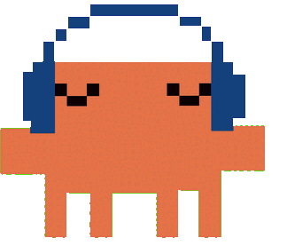
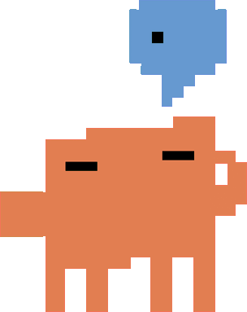
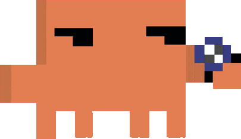
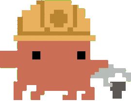
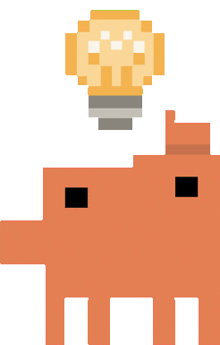

<p align="center">
  <picture>
    <source media="(prefers-color-scheme: dark)" srcset="https://shieldcn.dev/header/grid.svg?title=OpenAgentPet&amp;subtitle=A+floating+Pet+for+local+Claude+Code+sessions&amp;theme=violet&amp;align=center&amp;mode=dark&amp;border=false" />
    
  </picture>
</p>

<p align="center">
  <picture>
    <source media="(prefers-color-scheme: dark)" srcset="https://shieldcn.dev/npm/openagentpet.svg?variant=secondary&amp;size=sm&amp;mode=dark" />
    
  </picture>
  <picture>
    <source media="(prefers-color-scheme: dark)" srcset="https://shieldcn.dev/github/ci/niebag/openagentpet.svg?workflow=tests.yml&amp;branch=main&amp;variant=secondary&amp;size=sm&amp;mode=dark" />
    
  </picture>
  <picture>
    <source media="(prefers-color-scheme: dark)" srcset="https://shieldcn.dev/badge/license-MIT.svg?variant=secondary&amp;size=sm&amp;logo=opensourceinitiative&amp;mode=dark" />
    
  </picture>
  <picture>
    <source media="(prefers-color-scheme: dark)" srcset="https://shieldcn.dev/badge/macOS-13%2B.svg?variant=secondary&amp;size=sm&amp;logo=apple&amp;mode=dark" />
    
  </picture>
  <picture>
    <source media="(prefers-color-scheme: dark)" srcset="https://shieldcn.dev/badge/Claude_Code-supported.svg?variant=secondary&amp;size=sm&amp;logo=anthropic&amp;mode=dark" />
    
  </picture>
</p>

OpenAgentPet turns observable activity from each local Claude Code session into a small animated Pet that floats above your macOS windows. Pets are movable and resizable by default, and OpenAgentPet sends no prompt or transcript data off your Mac.

> [!NOTE]
> OpenAgentPet 1.2.0 is available from npm. The quick-start command installs the published release.

## Contents

- [Contents](#contents)
- [Preview](#preview)
- [Requirements](#requirements)
- [Quick start](#quick-start)
- [Activity states](#activity-states)
- [Tray controls](#tray-controls)
- [Pet packs](#pet-packs)
- [Privacy](#privacy)
- [Updates](#updates)
- [Removal](#removal)
- [Agent support](#agent-support)
- [License](#license)
- [Release validation](#release-validation)
- [Downloads](#downloads)
- [Contributors](#contributors)
- [Contributing](#contributing)
- [Disclaimer](#disclaimer)

## Preview

<table align="center">
  <tr>
    <th colspan="5" align="left">● ● ● &nbsp; macOS · Claude Code · local session</th>
  </tr>
  <tr>
    <th>Idle</th>
    <th>Thinking</th>
    <th>Researching</th>
    <th>Working</th>
    <th>Needs input</th>
  </tr>
  <tr>
    <td></td>
    <td></td>
    <td></td>
    <td></td>
    <td></td>
  </tr>
</table>

These previews show the bundled default Pet pack. The real Pet has a transparent, always-on-top window that floats above ordinary macOS windows; it is not embedded in Claude Code. Each spawned local session gets its own Pet.

## Requirements

- macOS 13 or newer
- Node.js 22.12 or newer, with npm
- Claude Code installed locally

Windows, Linux, Claude Desktop, Claude on the web, and remote Claude Code sessions are not supported.

## Quick start

Install the Companion app and the Claude Code plugin:

```sh
npx openagentpet install
```

Choose **Claude Code** in the installer and confirm the user-scope installation. Start a fresh Claude Code session, then run:

```text
/openagentpet:spawn
```

Remove that session's Pet when you no longer need it:

```text
/openagentpet:despawn
```

Spawn and Despawn are explicit and idempotent. Running Spawn twice refreshes the existing Pet for that session without changing its label; running Despawn when no Pet exists is harmless. Each Pet keeps a read-only label from the basename of its working directory at first Spawn. Ending a Claude Code session also removes its Pet.

## Activity states

OpenAgentPet describes observable Claude Code events, not the model's thoughts, intent, mood, progress, or success.

| Activity state | Shown when |
| --- | --- |
| **Idle** | A Pet is spawned or a Claude Code turn completes. |
| **Thinking** | You submit a prompt or a tool completes. |
| **Researching** | A built-in Claude Code web tool is running. |
| **Working** | Any other tool is running, including MCP tools. |
| **Needs input** | Claude Code is waiting for approval of a tool permission request. |

When events overlap, the display priority is Needs input, Researching, Working, Thinking, then Idle.

## Tray controls

One tray menu controls every Pet in the current Companion run:

- **Lock Pets** fixes every Pet at its current position and size and makes it click-through. Pets start unlocked, so you can move and resize each one from a 320 × 320 artwork area down to 160 × 160 or up to 640 × 640. Unlocking restores pointer input, movement, and resizing. Positions, sizes, and this setting last only for the current Companion run.
- **Hide Pets** removes all Pets from view without stopping their Activity updates. **Show Pets** restores them in their current states.
- **Reduced Motion** shows a stable frame for each Pet's current Activity state instead of playing its GIF.
- **Quit OpenAgentPet** removes every Pet and stops the Companion. Restarting the Companion does not restore old Pets.

## Pet packs

A Pet pack is one local `manifest.json` file plus exactly five different, decodable, transparent GIFs: one each for Idle, Thinking, Researching, Working, and Needs input. Asset paths must stay inside the pack directory.

Put custom packs in:

```text
~/Library/Application Support/OpenAgentPet/Pet Packs/
```

Choose the built-in default or an available custom pack interactively:

```sh
openagentpet pack use
```

Or select a pack by path:

```sh
openagentpet pack use "/path/to/My Pet"
```

A valid selection updates current Pets and future Pets. An invalid pack leaves the current selection unchanged. See [Pet packs](docs/pet-packs.md) for the manifest format and validation rules.

## Privacy

OpenAgentPet has no analytics, telemetry, crash reporting, account, cloud service, or remote-control endpoint.

The following data stays on your Mac:

- prompts, transcripts, full project and repository paths, tool arguments, and tool results;
- Pet pack manifests and GIFs;
- the selected Pet pack path and hook state used to resolve concurrent Activity states;
- each opaque Session identifier and all Companion state.

The Claude Code plugin talks to the Companion through a Unix-domain socket restricted to the current macOS user. Requests sent to that socket contain only the protocol version and one of these fixed payloads:

- Spawn: an opaque Session identifier, the Idle Activity state, and a read-only Pet label derived from the working-directory basename. The full directory path never enters the Companion protocol;
- Activity update: an opaque Session identifier and one of the five Activity states;
- Despawn or session end: an opaque Session identifier;
- Pet pack selection: the local path to the selected pack.

The Companion replies with a success result, a failure result, or a failure result with a local error message. Responses do not include the Session identifier, Activity state, Pet label, or Pet pack path.

npm network access may occur when you run `npx openagentpet install`, including a rerun; when a confirmed install, repair, or update runs `npm install --global`; after a user-invoked Spawn or Despawn triggers the at-most-once-per-24-hours version check; or after you explicitly confirm an available update. Companion launch, Activity hooks, Pet pack selection, and background timers do not contact npm.

## Updates

Rerun the installer to inspect and repair or update the local Companion and user-scope Claude Code plugin:

```sh
npx openagentpet install
```

After Spawn or Despawn, OpenAgentPet may report a newer compatible npm release. It shows the installed and available versions first and never installs the update without confirmation. Declining or failing an update does not block the Pet command you already ran.

## Removal

Quit OpenAgentPet from the tray, then remove the user-scope plugin, its marketplace entry, and the npm package:

```sh
claude plugin uninstall openagentpet@openagentpet --scope user
claude plugin marketplace remove openagentpet --scope user
npm uninstall --global openagentpet
```

These commands do not delete custom Pet packs or selection data under `~/Library/Application Support/OpenAgentPet/`.

## Agent support

Claude Code is the only supported Agent integration in the first release. Codex is **Coming soon**. OpenAgentPet does not currently support Claude Desktop, Claude on the web, or remote sessions.

## License

Project-owned source is released under the [MIT License](LICENSE). The bundled Clawd GIFs are not covered by this license. Dependencies retain their own licenses; npm installs Electron as a separate dependency.

## Release validation

Maintainers can validate the npm artifact, Claude Code marketplace, command behavior, and native macOS windows with:

```sh
npm run test:release
```

The release check packs and installs the tarball in a temporary prefix, runs the macOS smoke test against that installed package, installs the plugin at user scope in an isolated Claude Code configuration, executes the unit tests, and validates the marketplace metadata.

## Downloads

<p align="center">
  <picture>
    <source media="(prefers-color-scheme: dark)" srcset="https://shieldcn.dev/chart/npm/openagentpet.svg?days=90&amp;theme=violet&amp;mode=dark" />
    
  </picture>
</p>

## Contributors

<p align="center">
  <picture>
    <source media="(prefers-color-scheme: dark)" srcset="https://shieldcn.dev/contributors/niebag/openagentpet.svg?theme=violet&amp;mode=dark" />
    
  </picture>
</p>

## Contributing

See [CONTRIBUTING.md](CONTRIBUTING.md). OpenAgentPet uses Conventional Commits.

## Disclaimer

OpenAgentPet is an independent, unofficial project. It is not affiliated with, endorsed by, or sponsored by Anthropic. Claude, Claude Code, Clawd, Anthropic, and the bundled Clawd artwork belong to their respective owners.
